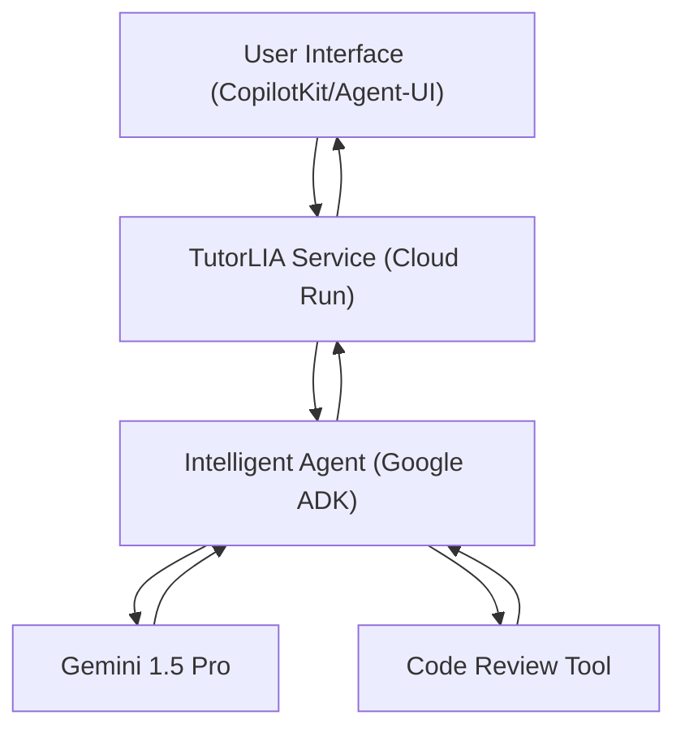

## LIA: Study and Code Review Assistant
LIA is an intelligent AI agent, designed to assist programming students. It acts as a tutor and code reviewer, offering educational support, constructive feedback, and clear explanations of programming concepts.

Our goal is to create a tool that encourages learning, helping the student understand the logic and find the solution, rather than simply providing the answer.

## Project Definition

The project is a conversational AI agent capable of:

- Analyzing and reviewing code in real-time, identifying syntax and logic errors, and suggesting performance improvements and best practices.

- Explaining complex programming concepts in a simple and direct way, using examples and analogies.

- Interacting in a contextual manner, maintaining conversation history for more effective learning.

## Requirements

**Functional Requirements**

- Code Review: The agent must be able to analyze a piece of code and provide detailed feedback.

- Concept Explanation: It must be able to answer questions about programming logic and theory.

- Support for Multiple Languages: The agent should be capable of processing and understanding code in Python, JavaScript, Java, and other popular languages.

- Conversational Interface: Communication with the student must be fluid and intuitive.

**Non-Functional Requirements**

- Scalability: The architecture must be robust enough to handle a growing number of users.

- Security: The execution environment must be secure to protect student code and data.

- Latency: The assistant's responses must be fast for a good user experience.

## Architecture

The project's architecture is modular and decoupled, using Google tools and modern AI development kits.

**Execution Flow**
- The student interacts with the User Interface (frontend).

- The request is sent to the LIA Tutor Service (backend), which hosts the agent.

- The Agent (Google ADK) receives the request and, with the help of Gemini, decides which action to take.

- If the action is to review code, Gemini makes a "function call" to the Code Review Tool.

- The agent receives the response from the tool and uses it to formulate the final answer, which is sent back to the student.

## Tools and Technologies
Assistant’s Brain: Google Gemini 1.5 Pro or 1.5 Flash.

Agent Framework: Google Agent Development Kit (ADK).

Backend: Python with frameworks such as FastAPI.

Frontend: CopilotKit or Agent-UI for a rich, modern user experience.

Deployment: Google Cloud Run for a serverless and scalable environment.

Version Control: GitHub.

## How to Contribute

If you are interested in the idea and would like to contribute, please feel free to open an `Issue` or a `Pull Request`. We welcome all ideas and suggestions!

## License

This project is licensed under the [GNU GENERAL PUBLIC LICENSE](https://github.com/lidymonteiro/tutorlia/blob/main/LICENSE)
